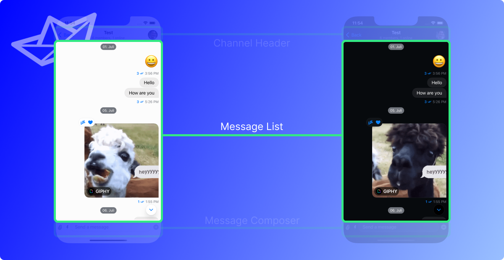
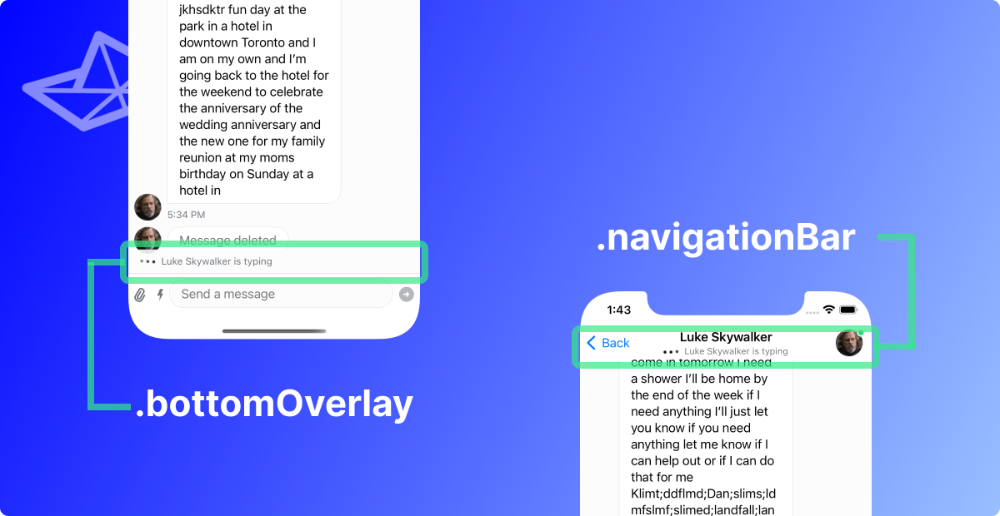
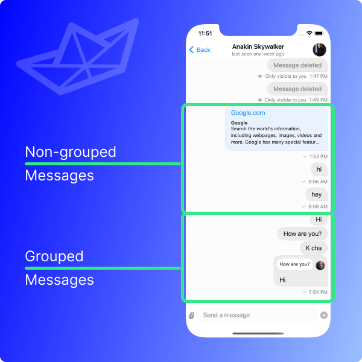
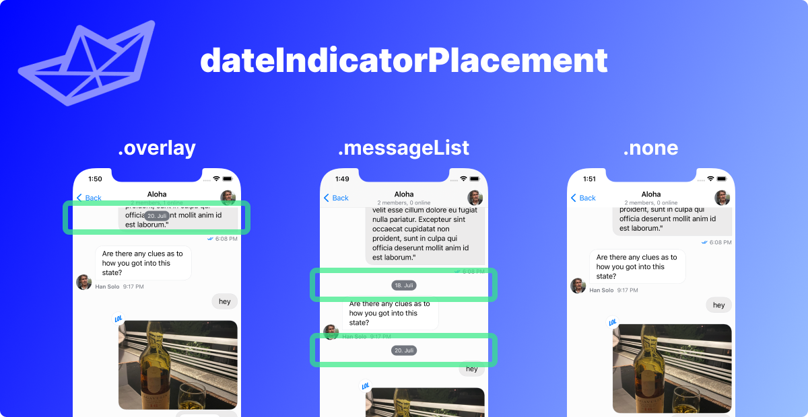

## What is the Message List?



The message list is the place to show a list of the messages of a specific channel.

A message can come in **many different forms**. If you are looking for the different types of messages and how to customize them the place to look for is the [Message Components](../message-components/custom-avatar) section. The Message List is really handling the **list of the messages** that a channel contains.

The **default message list implementation** in the SDK follows the style of **other messaging apps** such as Apple's iMessage, Facebook Messenger, WhatsApp, Viber, and many other. In these kinds of apps, the **current sender's messages** are displayed on the **right side**, while the **other participants' messages** are displayed on the **left side**. In addition to that, there is an **avatar** of the user sending a message shown.

## Customization options

For general customizations, the best place to start is the `MessageListConfig`. This is a configuration file that can be used in the `Utils` class that is handed to the `StreamChat` object upon initialization. The [Message List Configuration](#message-list-configuration) chapter is handling everything related to this type of customization.

:::note
Reminder: The configuration of the `StreamChat` object is recommended to be happening in the `AppDelegate` file. A guide on how to do this can be found [here](../getting-started.md).
:::

It is also possible to replace the screen that is shown when there are no messages yet in the current channel. This can be achieved by overriding the `makeEmptyMessagesView` function in the `ViewFactory`. Read more in the [No Messages](#no-messages-view) section.

## Message List Configuration

The `MessageListConfig` is a helper struct that allows customization of the `MessageList` in a unified, straightforward manner. The way this is done is by handing it into the `Utils` class that is then handed to the `StreamChat` initializer upon creation.

Here is an example of how to do this:

```swift
let messageListConfig = MessageListConfig()
let utils = Utils(messageListConfig: messageListConfig)
streamChat = StreamChat(chatClient: chatClient, utils: utils)
```

:::note
This code snippet is normally located in the `AppDelegate.swift` file inside of the `didFinishLaunchingWithOptions` function. If you are unsure of where to put that, you can follow the [Getting Started](../getting-started.md) for a detailed description.
:::

This does **not** do any customization as it only uses the default parameters from the `MessageListConfig`. Due to the fact that there are default parameters for every option it is easy to only specify the customization options that are needed in the specific use-case.

Every one of them is discussed in the next chapters, but here is an overview over all the options that are configureable in the `MessageListConfig` together with their types and default values (click on the parameter name to jump directly to the section where they are explained in more detail):

| Parameter                                                                       | Type                       | Default                          |
| ------------------------------------------------------------------------------- | -------------------------- | -------------------------------- |
| [messageListType](#messagelisttype)                                             | `MessageListType`          | `.messaging`                     |
| [typingIndicatorPlacement](#typingindicatorplacement)                           | `TypingIndicatorPlacement` | `.bottomOverlay`                 |
| [groupMessages](#groupmessages)                                                 | `Bool`                     | `true`                           |
| [messageDisplayOptions](#messagedisplayoptions)                                 | `MessageDisplayOptions`    | `MessageDisplayOptions()`        |
| [messagePaddings](#messagepaddings)                                             | `MessagePaddings`          | `MessagePaddings(horizontal: 8)` |
| [dateIndicatorPlacement](#dateindicatorplacement)                               | `DateIndicatorPlacement`   | `.overlay`                       |
| [pageSize](#pagesize)                                                           | `Int`                      | `50`                             |
| messagePopoverEnabled                                                           | `Bool`                     | `true`                           |
| doubleTapOverlayEnabled                                                         | `Bool`                     | `false`                          |
| becomesFirstResponderOnOpen                                                     | `Bool`                     | `false`                          |
| updateChannelsFromMessageList                                                   | `Bool`                     | `false`                          |
| [maxTimeIntervalBetweenMessagesInGroup](#maxtimeintervalbetweenmessagesingroup) | `TimeInterval`             | `60`                             |
| cacheSizeOnChatDismiss                                                          | `Int`                      | `1024 * 1024 * 100`              |

The next sections will go through these values and discuss the impact they have when altered.

### messageListType

The `MessageListType` enum has four cases:

- `.messaging`
- `.team`
- `.livestream`
- `.commerce`

The goal with that is to have an easy configuration option to support different types of chat interfaces that are tailored towards specific use-cases.

Currently, the only one supported is the `.messaging` case, which is also the default. The documentation will be updated once the other cases are supported as well.

### typingIndicatorPlacement

When the user is located in the message list and another user is typing a message an indicator is shown. The SDK allows for two different configuration options in this case.

The default is the `.bottomOverlay`. Here, the typing indicator is shown in the bottom part of the message list. The alternate option, `.navigationBar`, is showing the typing indicator in the navigation bar, as the name suggests.

Here is an example for both of the options:



In case you want to set the `.navigationBar` option here is a snippet of code that achieves that. This goes into the `didFinishLaunchingWithOptions` function of the `AppDelegate.swift` file:

```swift
let utils = Utils(
    messageListConfig: MessageListConfig(typingIndicatorPlacement: .navigationBar)
)
streamChat = StreamChat(chatClient: chatClient, utils: utils)
```

### groupMessages

The SDK offers the option to group messages of a user together to show them in a more compact way. The `groupMessages` parameter specifies if this behavior is wanted or not.

The default value is `true`, an example for both looks can be seen below:



:::note
To identify which messages to group together the SDK uses the `maxTimeIntervalBetweenMessagesInGroup` parameter that is also part of the `MessageListConfig`. For more details on this parameter the [`maxTimeIntervalBetweenMessagesInGroup`](#maxtimeintervalbetweenmessagesingroup) section is provided.
:::

### messageDisplayOptions

TODO

You can control the display of the helper views around the message (date indicators, avatars) and paddings, via the `MessageListConfig`'s properties `MessageDisplayOptions` and `MessagePaddings`. The `MessageListConfig` is part of the `Utils` class in `StreamChat`. Here's an example on how to hide the date indicators and avatars, while also increasing the horizontal padding.

```swift
let messageDisplayOptions = MessageDisplayOptions(showAvatars: false, showMessageDate: false)
let messagePaddings = MessagePaddings(horizontal: 16)
let messageListConfig = MessageListConfig(
    messageListType: .messaging,
    typingIndicatorPlacement: .navigationBar,
    groupMessages: true,
    messageDisplayOptions: messageDisplayOptions,
    messagePaddings: messagePaddings
)
let utils = Utils(messageListConfig: messageListConfig)
streamChat = StreamChat(chatClient: chatClient, utils: utils)
```

- `messagePopoverEnabled` - the default value is true. If set to false, it will disable the message popover.
- `doubleTapOverlayEnabled` - the default value is false. If set to true, you can show the message popover also with double tap.
- `becomesFirstResponderOnOpen` - the default value is false. If set to true, the channel will open the keyboard on view appearance.

With the `MessageDisplayOptions`, you can also customize the transitions applied to the message views. The default message view transition in the SDK is `identity`. You can use the other default ones, such as `scale`, `opacity` and `slide`, or you can create your own custom transitions. Here's an example how to do this:

```swift
var customTransition: AnyTransition {
    .scale.combined(with:
        AnyTransition.asymmetric(
            insertion: .move(edge: .trailing),
            removal: .move(edge: .leading)
        )
    )
}

let messageDisplayOptions = MessageDisplayOptions(
    currentUserMessageTransition: customTransition,
    otherUserMessageTransition: customTransition
)
```

For link attachments, you can control the link text attributes (font, font weight, color) based on the message. Here's an example of how to change the link color based on the message sender, with the `messageLinkDisplayResolver`:

```swift
let messageDisplayOptions = MessageDisplayOptions(messageLinkDisplayResolver: { message in
    let color = message.isSentByCurrentUser ? UIColor.red : UIColor.green

    return [
        NSAttributedString.Key.foregroundColor: color
    ]
})
let messageListConfig = MessageListConfig(messageDisplayOptions: messageDisplayOptions)
let utils = Utils(messageListConfig: messageListConfig)

let streamChat = StreamChat(chatClient: chatClient, utils: utils)
```

### messagePaddings

The `messagePaddings` parameter is intended to be able to specify horizontal padding (left & right) to all messages. This can be done by intialization of a `MessagePaddings` object with the only parameter being `horizontal`. The default value it has is `8` and any other `CGFloat` can be specified.

An example of how to set the padding to e.g. a value of `40` can be found here:

```swift
let messageListConfig = MessageListConfig(
// highlight-start
    messagePaddings: MessagePaddings(horizontal: 40)
// highlight-end
)
let utils = Utils(messageListConfig: messageListConfig)
streamChat = StreamChat(chatClient: chatClient, utils: utils)
```

### dateIndicatorPlacement

The date indicator describes an element that displays the date in the message list. It must not be confused with the date of a specific message (TODO: link to the docs here.) The SDK supports three types of date indicators

- floating overlay (`.overlay`)
- date separators in-between the messages (`.messageList`)
- show no date indicators (`.none`)



This feature can be configured via the `dateIndicatorPlacement` in the `MessageListConfig`. With the floating overlay option (`.overlay`), the date indicator is shown for a short time whenever a new message appears and during scrolling. On the other hand, in order to always show the date between messages, similarly to Apple Messages and WhatsApp, the `.messageList` option should be used. Both options can be turned off by using the `.none` option.

The default option is `.overlay`. In order to change that e.g. to the `messageList` option, this code can be used:

```swift
let messageListConfig = MessageListConfig(
// highlight-start
    dateIndicatorPlacement: .messageList
// highlight-end
)
let utils = Utils(messageListConfig: messageListConfig)
let streamChat = StreamChat(chatClient: chatClient, utils: utils)
```

### pageSize

The `pageSize` parameter specifies how many messages are loaded by the SDK in a chunk before requesting new messages. The default value of `50` specifies that 50 messages are loaded when entering the channel. When the user scrolls to previous messages and the first 50 are passed the next chunk of 50 messages are loaded again.

This value can be changed to any other `Int`. It should be considered, however, that there might be performance and networking considerations to take into account when changing up this value.

In order to change this value e.g. to have a `pageSize` of `100`, this code can be used:

```swift
let messageListConfig = MessageListConfig(
// highlight-start
    pageSize: 100
// highlight-end
)
let utils = Utils(messageListConfig: messageListConfig)
streamChat = StreamChat(chatClient: chatClient, utils: utils)
```

### maxTimeIntervalBetweenMessagesInGroup

The messages in the message list are grouped based on the `maxTimeIntervalBetweenMessagesInGroup` value in the `MessageListConfig` (if the [`groupMessages`](#groupmessages) option is set to `true`). It specifies a `TimeInterval` which determines how far apart messages can maximally be to be grouped together.

The default value of this property is 60 seconds, which means messages that are 60 seconds (or less) apart, will be grouped together. Messages that are farther apart are not grouped together and appear as standalone messages. An example for that can be seen in the [groupMessages](#groupmessages) section.

To change it up from the default value (`60` seconds) a different value (in this case: `20` seconds) can be specified like this:

```swift
let messageListConfig = MessageListConfig(
// highlight-start
    maxTimeIntervalBetweenMessagesInGroup: 20
// highlight-end
)
let utils = Utils(messageListConfig: messageListConfig)
streamChat = StreamChat(chatClient: chatClient, utils: utils)
```

## No Messages View
